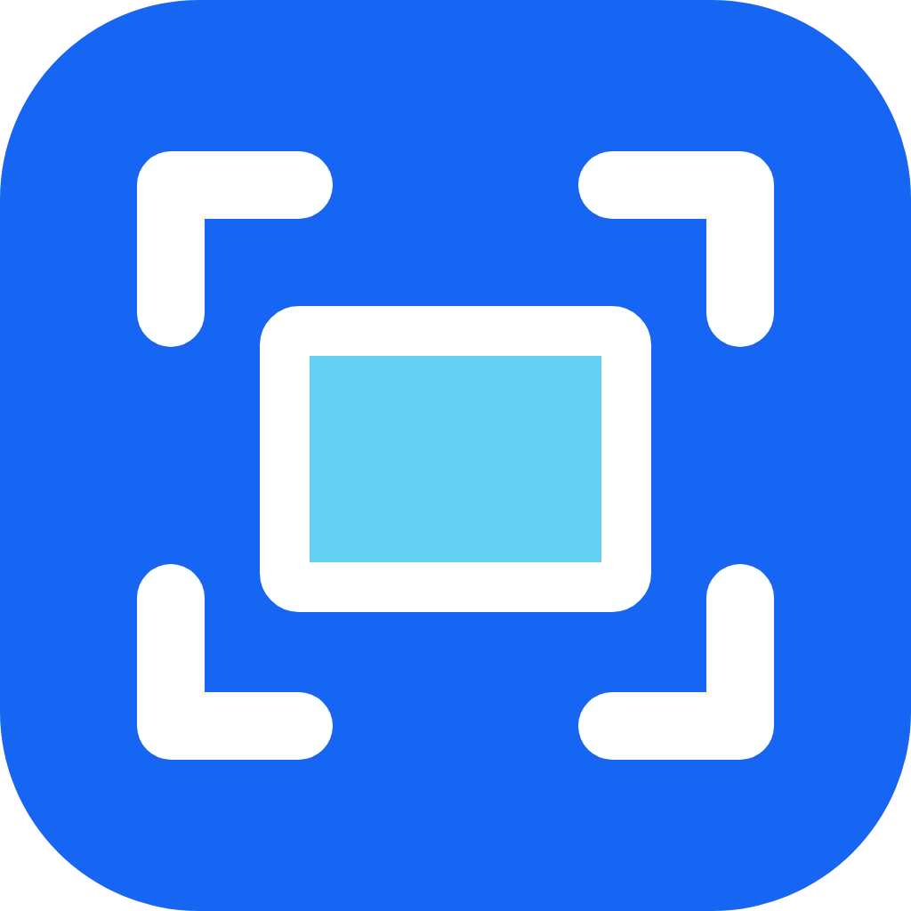
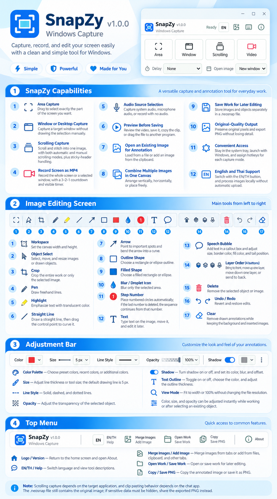
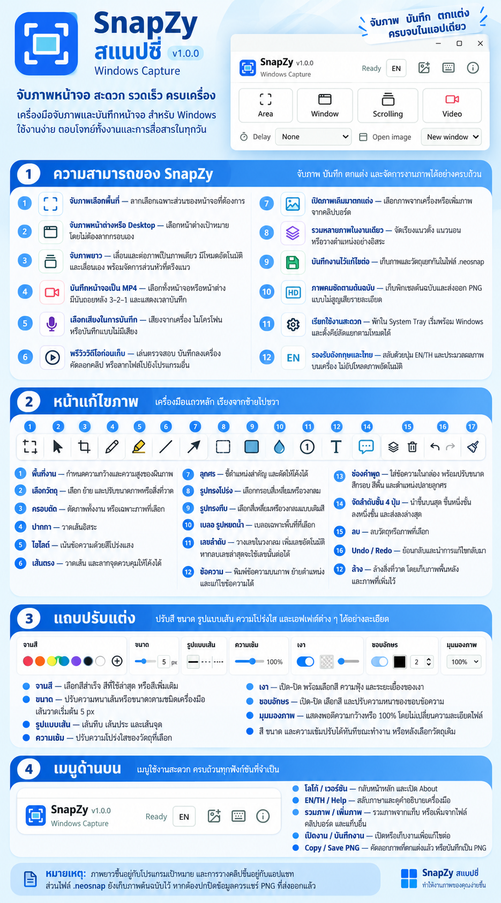

# SnapZy for Windows

[English](#english) | [ภาษาไทย](#snapzy-สำหรับ-windows) | [Download / ดาวน์โหลด](https://github.com/jairlinethai8989/snapzy-releases/raw/refs/heads/main/downloads/Snapzy-Setup-1.0.0.exe)

**Open source:** [SnapZy source code (MIT)](source/snapzy/README.md). The license covers the application source; brand artwork and release media remain separately reserved.

## English

**Capture what matters. Share it clearly.**

SnapZy is a free Windows screen-capture tool for selected areas, windows, and long scrolling pages. It also includes video recording and an image editor for annotations and combining images.

## Download

**SnapZy 1.0.0 for Windows (64-bit), installer updated October 7, 2026**

[Download the installer](https://github.com/jairlinethai8989/snapzy-releases/raw/refs/heads/main/downloads/Snapzy-Setup-1.0.0.exe) · [Release notes](releases/v1.0.0.md) · [Verify SHA-256](checksums/Snapzy-Setup-1.0.0.exe.sha256)

The installer is about 7.94 MB and does not bundle .NET. It reuses a compatible installed runtime, or asks permission to download and install the official Microsoft runtime when missing. The October 7 refresh fixes an incorrect missing-.NET error after successful installation. The existing download URL is retained.

The installer is not code-signed, so Windows SmartScreen may show a warning. Review the release notes and verify the checksum before installing. SnapZy uses a separate app identity and installation profile from the private Neo Snap build.

## Highlights

1. **Area capture:** drag to select exactly the part of the screen you need.
2. **Window or desktop capture:** select a target window or desktop without drawing a selection manually.
3. **Scrolling capture:** scroll and stitch content into one long image, with automatic/manual modes and stationary-header/footer handling.
4. **MP4 screen recording:** record a screen or window with a 3-2-1 countdown, recording controls, and elapsed time.
5. **Audio selection:** record system audio, microphone audio, both, or no audio.
6. **Preview before saving:** play the recorded clip, save it, copy the clip, or drag it into another application.
7. **Open images for editing:** browse existing images or add an image from the clipboard.
8. **Combine multiple images:** arrange them vertically, horizontally, or freely in one editable workspace.
9. **Save work for later:** retain original images and editable objects in a `.neosnap` project file.
10. **Original-quality output:** retain source pixels and export lossless PNG; Fit/100% changes the view, not the saved resolution.
11. **Convenient access:** run in the system tray, optionally start with Windows, and configure hotkeys separately for each capture mode.
12. **English and Thai:** switch with EN/TH and process captures locally without automatic screen-content uploads.

### English Feature Poster

[Open the full-resolution English poster](assets/snapzy-poster-en.png). This is an illustrated overview; the reference below describes the application's actual controls.

<strong>Image editor reference: tools, adjustments, and top menu</strong>

### Main Tools, Left to Right

| No. | Tool | What It Does |
| --- | --- | --- |
| 1 | Workspace size | Set the canvas width and height. |
| 2 | Select | Select, move, and resize images or drawn objects. |
| 3 | Crop | Crop the whole workspace, or only the selected image. |
| 4 | Pen | Draw freehand lines. |
| 5 | Highlighter | Emphasize text with translucent color. |
| 6 | Line | Draw a straight line; drag its control handle to bend it into a curve. |
| 7 | Arrow | Point to important details; the control handle can bend the arrow into a curve. |
| 8 | Outline shapes | Choose a rectangle or circle/ellipse outline. |
| 9 | Filled shapes | Choose a solid rectangle or circle/ellipse. |
| 10 | Blur (droplet icon) | Blur only the selected region. |
| 11 | Numbered marker | Place numbered circles automatically. The next number follows the highest remaining marker; deleting the latest marker reuses its number. A new capture starts at 1. |
| 12 | Text | Type text on the image, move it, and edit it later. |
| 13 | Speech bubble | Add text inside a callout; adjust its size, fill, border, and tail position. |
| 14 | Layer order: four buttons | Bring to front, raise one layer, lower one layer, or send to back. Applies to selected annotations and added images. |
| 15 | Delete | Remove the selected object or image. |
| 16 | Undo / Redo | Revert edits or restore them. |
| 17 | Clear | Remove drawn annotations while keeping the background and added images. |

### Adjustment Bar

| Control | What It Does |
| --- | --- |
| Color palette | Choose preset colors, recent colors, or a custom color. |
| Size | Adjust stroke width or tool-specific size. Drawing strokes default to 5 image pixels. |
| Line style | Choose solid, dashed, or dotted strokes for supported drawing tools. |
| Opacity | Adjust the selected object's transparency. |
| Shadow | Enable/disable annotation shadows; choose their color, blur, and horizontal/vertical offsets. |
| Text outline | Enable/disable a text border, with its own color and thickness. |
| Speech-bubble settings | Set fill color, border color, and border thickness independently from text. |
| View mode | Fit to width or view at 100% without changing exported image resolution. |

Color, size, and opacity can be adjusted immediately while working or after selecting an existing object. Supported changes can be undone and redone.

### Top Menu

| Menu | What It Does |
| --- | --- |
| Logo / Home | Return to the capture menu without closing the image. |
| Version / About | Show the app version, developer, update date, and a summary of changes. |
| EN / TH | Switch the interface language. |
| Help | Open descriptions of the editor controls. |
| Combine images | Combine captures from open tabs/windows vertically, horizontally, or freely. |
| Add images | Add files, clipboard images, or images from other capture tabs. |
| Open project / Save project | Open or save a `.neosnap` project to continue editing later. |
| Copy / Save PNG | Copy the annotated image or export it as PNG. |

## Donate

SnapZy is free to use. If it is useful to you, you can support its continued development with PromptPay:

Click the QR image to open its original size for scanning. Donations are optional.

## Requirements

- Windows 10 (version 2004 or newer) or Windows 11, 64-bit
- Microsoft Edge WebView2 Runtime
- .NET 10 Desktop Runtime 10.0.12 or a compatible newer stable 10.0 patch (x64)
- Microsoft Visual C++ 2015–2022 Redistributable (x64)

The installer will check for required components and explain how to install anything missing.

## Privacy

SnapZy processes captures and recordings locally. It does not upload screen contents. See the release notes and included privacy information for details about each release.

Scrolling capture depends on the target application; automatic scrolling is not guaranteed for every sheet, PDF reader, or layout. Clip paste support depends on the receiving app; dragging the clip file is an alternative. SnapZy never sends chat messages automatically.

**Project files retain original images, including information hidden by blur, shapes, or crop. Share the exported PNG instead when sensitive information must be hidden.**

---

# SnapZy สำหรับ Windows

**จับภาพสิ่งสำคัญ สื่อสารได้ชัดเจน**

SnapZy เป็นโปรแกรมจับภาพหน้าจอฟรีสำหรับ Windows รองรับการจับภาพพื้นที่ที่เลือก หน้าต่าง และหน้าเว็บหรือเอกสารแบบเลื่อนยาว พร้อมบันทึกวิดีโอและเครื่องมือตกแต่งภาพ

## ดาวน์โหลด

**SnapZy 1.0.0 สำหรับ Windows (64-bit), อัปเดตตัวติดตั้ง 7 ตุลาคม 2026**

[ดาวน์โหลดตัวติดตั้ง](https://github.com/jairlinethai8989/snapzy-releases/raw/refs/heads/main/downloads/Snapzy-Setup-1.0.0.exe) · [บันทึกประจำรุ่น](releases/v1.0.0.md) · [ตรวจสอบ SHA-256](checksums/Snapzy-Setup-1.0.0.exe.sha256)

ตัวติดตั้งขนาดประมาณ 7.94 MB ไม่รวม .NET โดยใช้รุ่นที่รองรับซึ่งมีอยู่แล้ว หรือถามยืนยันก่อนดาวน์โหลดและติดตั้งจาก Microsoft หากยังไม่มี การปรับปรุงครั้งนี้แก้ปัญหาแจ้งว่าไม่พบ .NET ทั้งที่ติดตั้งสำเร็จแล้ว และยังใช้ลิงก์ดาวน์โหลดเดิม

ตัวติดตั้งยังไม่มีลายเซ็นดิจิทัล Windows SmartScreen จึงอาจแสดงคำเตือน โปรดอ่านบันทึกประจำรุ่นและตรวจสอบ checksum ก่อนติดตั้ง SnapZy ใช้ตัวตนและโปรไฟล์ติดตั้งแยกจาก Neo Snap รุ่น private ภายในบริษัท

## ความสามารถ

1. **จับภาพเลือกพื้นที่:** ลากเลือกเฉพาะส่วนของหน้าจอที่ต้องการ
2. **จับภาพหน้าต่างหรือ Desktop:** เลือกหน้าต่างเป้าหมายหรือ Desktop โดยไม่ต้องลากกรอบเอง
3. **จับภาพยาว:** เลื่อนและต่อภาพเป็นภาพเดียว มีโหมดอัตโนมัติและเลื่อนเอง พร้อมจัดการส่วนหัวและท้ายที่อยู่กับที่
4. **บันทึกหน้าจอเป็น MP4:** เลือกหน้าจอหรือหน้าต่าง มีนับถอยหลัง 3-2-1 ปุ่มควบคุม และแสดงเวลาบันทึก
5. **เลือกเสียงในการบันทึก:** เสียงจากเครื่อง ไมโครโฟน ทั้งสองแหล่ง หรือบันทึกแบบไม่มีเสียง
6. **พรีวิววิดีโอก่อนเก็บ:** เล่นตรวจสอบ บันทึกลงเครื่อง คัดลอกคลิป หรือลากไฟล์ไปยังโปรแกรมอื่น
7. **เปิดภาพเดิมมาตกแต่ง:** เลือกภาพจากเครื่องหรือเพิ่มภาพจากคลิปบอร์ด
8. **รวมหลายภาพในงานเดียว:** จัดเรียงแนวตั้ง แนวนอน หรือวางตำแหน่งอย่างอิสระ
9. **บันทึกงานไว้แก้ไขต่อ:** เก็บภาพต้นฉบับและวัตถุที่แก้ไขได้ในไฟล์ `.neosnap`
10. **ภาพคมชัดตามต้นฉบับ:** เก็บพิกเซลต้นฉบับและส่งออก PNG แบบไม่สูญเสียรายละเอียด การแสดงพอดี/100% ไม่เปลี่ยนความละเอียดไฟล์
11. **เรียกใช้งานสะดวก:** พักใน System Tray เลือกเริ่มพร้อม Windows และตั้งคีย์ลัดแยกตามโหมดจับภาพได้
12. **รองรับอังกฤษและไทย:** สลับด้วยปุ่ม EN/TH และประมวลผลภาพบนเครื่อง ไม่อัปโหลดภาพอัตโนมัติ

### โปสเตอร์ภาษาไทย

[เปิดโปสเตอร์ภาษาไทยความละเอียดเต็ม](assets/snapzy-poster-th.png) โปสเตอร์เป็นภาพประกอบสรุปความสามารถ ส่วนคำอธิบายด้านล่างอ้างอิงปุ่มที่มีในโปรแกรม

<strong>คำอธิบายหน้าแก้ไขภาพ: เครื่องมือ แถบปรับแต่ง และเมนูด้านบน</strong>

### เครื่องมือหลัก เรียงจากซ้ายไปขวา

| ลำดับ | เครื่องมือ | การทำงาน |
| --- | --- | --- |
| 1 | พื้นที่งาน | กำหนดความกว้างและความสูงของผืนภาพ |
| 2 | เลือกวัตถุ | เลือก ย้าย และปรับขนาดภาพหรือสิ่งที่วาด |
| 3 | ครอบตัด | ตัดภาพทั้งงาน หรือเฉพาะภาพที่เลือก |
| 4 | ปากกา | วาดเส้นอิสระ |
| 5 | ไฮไลต์ | เน้นข้อความด้วยสีโปร่งแสง |
| 6 | เส้นตรง | วาดเส้น และลากจุดควบคุมให้โค้งได้ |
| 7 | ลูกศร | ชี้ตำแหน่งสำคัญ และดัดให้โค้งได้ |
| 8 | รูปทรงโปร่ง | เลือกกรอบสี่เหลี่ยมหรือวงกลม/วงรี |
| 9 | รูปทรงทึบ | เลือกสี่เหลี่ยมหรือวงกลม/วงรีแบบเติมสี |
| 10 | เบลอ รูปหยดน้ำ | เบลอเฉพาะพื้นที่ที่เลือก |
| 11 | เลขลำดับ | วางเลขในวงกลมอัตโนมัติ นับต่อจากเลขสูงสุดที่ยังอยู่ หากลบเลขล่าสุดจะใช้เลขนั้นต่อได้ และเริ่มที่ 1 เมื่อจับภาพใหม่ |
| 12 | ข้อความ | พิมพ์ข้อความบนภาพ ย้ายตำแหน่ง และแก้ไขข้อความได้ |
| 13 | ช่องคำพูด | ใส่ข้อความในกล่อง พร้อมปรับขนาด สีกรอบ สีพื้น และตำแหน่งปลายลูกศร |
| 14 | จัดลำดับชั้น 4 ปุ่ม | นำขึ้นบนสุด ขึ้นหนึ่งชั้น ลงหนึ่งชั้น และส่งลงล่างสุด ใช้กับวัตถุหรือภาพที่เพิ่มและเลือกอยู่ |
| 15 | ลบ | ลบวัตถุหรือภาพที่เลือก |
| 16 | Undo / Redo | ย้อนกลับและนำการแก้ไขกลับมา |
| 17 | ล้าง | ล้างสิ่งที่วาด โดยเก็บภาพพื้นหลังและภาพที่เพิ่มไว้ |

### แถบปรับแต่ง

| ตัวเลือก | การทำงาน |
| --- | --- |
| จานสี | เลือกสีสำเร็จ สีที่ใช้ล่าสุด หรือสีเพิ่มเติม |
| ขนาด | ปรับความหนาเส้นหรือขนาดตามชนิดเครื่องมือ เส้นวาดเริ่มต้น 5 พิกเซลของภาพ |
| รูปแบบเส้น | เส้นทึบ เส้นประ และเส้นจุด สำหรับเครื่องมือวาดที่รองรับ |
| ความเข้ม | ปรับความโปร่งใสของวัตถุที่เลือก |
| เงา | เปิด-ปิดเงาของสิ่งที่วาด พร้อมเลือกสี ความฟุ้ง และระยะเยื้องแนวนอน/แนวตั้ง |
| ขอบอักษร | เปิด-ปิด เลือกสี และปรับความหนาของขอบข้อความ |
| ตั้งค่าช่องคำพูด | เลือกสีพื้น สีกรอบ และความหนากรอบ แยกจากสีข้อความ |
| มุมมองภาพ | แสดงพอดีความกว้างหรือ 100% โดยไม่เปลี่ยนความละเอียดไฟล์ที่ส่งออก |

สี ขนาด และความเข้มปรับได้ทันทีขณะทำงาน หรือหลังเลือกวัตถุเดิม และย้อนกลับ/ทำซ้ำการเปลี่ยนแปลงที่รองรับได้

### เมนูด้านบน

| เมนู | การทำงาน |
| --- | --- |
| โลโก้ / หน้าหลัก | กลับเมนูจับภาพโดยไม่ปิดภาพที่กำลังแก้ไข |
| เวอร์ชัน / About | แสดงเวอร์ชัน ผู้พัฒนา วันที่อัปเดต และสรุปสิ่งที่เปลี่ยนแปลง |
| EN / TH | สลับภาษาเมนู |
| Help | ดูคำอธิบายเครื่องมือในหน้าแก้ไขภาพ |
| รวมภาพ | รวมภาพจากแท็บ/หน้าต่างที่เปิดอยู่ แบบแนวตั้ง แนวนอน หรือจัดวางอิสระ |
| เพิ่มภาพ | เพิ่มภาพจากไฟล์ คลิปบอร์ด หรือแท็บภาพอื่น |
| เปิดงาน / บันทึกงาน | เปิดหรือเก็บไฟล์ `.neosnap` เพื่อแก้ไขต่อ |
| Copy / Save PNG | คัดลอกภาพที่ตกแต่งแล้ว หรือบันทึกเป็น PNG |

## สนับสนุนผู้พัฒนา

SnapZy ใช้งานได้ฟรี หากโปรแกรมมีประโยชน์และต้องการสนับสนุนการพัฒนาต่อ สามารถสแกน PromptPay ได้ที่นี่:

การสนับสนุนเป็นทางเลือก กดภาพ QR เพื่อเปิดขนาดต้นฉบับสำหรับสแกน

## ความต้องการของระบบ

- Windows 10 รุ่น 2004 ขึ้นไป หรือ Windows 11 แบบ 64 บิต
- Microsoft Edge WebView2 Runtime
- .NET 10 Desktop Runtime 10.0.12 หรือแพตช์ 10.0 รุ่นเสถียรที่ใหม่กว่า (x64)
- Microsoft Visual C++ 2015–2022 Redistributable (x64)

ตัวติดตั้งจะตรวจสอบส่วนประกอบที่จำเป็นและแนะนำวิธีติดตั้งหากยังขาดอยู่

## ความเป็นส่วนตัว

SnapZy ประมวลผลภาพหน้าจอและวิดีโอบนเครื่อง และไม่อัปโหลดเนื้อหาบนหน้าจอ โปรดดูรายละเอียดในบันทึกประจำรุ่นและข้อมูลความเป็นส่วนตัวที่แนบมากับแต่ละรุ่น

การจับภาพยาวขึ้นอยู่กับโปรแกรมเป้าหมาย ไม่รับประกันการเลื่อนอัตโนมัติในทุกแผ่นงาน โปรแกรมอ่าน PDF หรือรูปแบบหน้าจอ การวางคลิปขึ้นอยู่กับแอปปลายทาง หากวางไม่ได้สามารถลองลากไฟล์แทน SnapZy ไม่ส่งข้อความเข้าห้องแชทอัตโนมัติ

**ไฟล์งานยังเก็บภาพต้นฉบับ รวมถึงข้อมูลที่เบลอ ปิดทับ หรือครอบตัดไว้ หากต้องปกปิดข้อมูลควรแชร์ PNG ที่ส่งออกแล้วแทนไฟล์งาน**

## ซอร์สโค้ด

[ซอร์สโค้ด SnapZy ภายใต้ MIT](source/snapzy/README.md) มีวิธี build และประกาศลิขสิทธิ์ของไลบรารีที่ใช้ ใบอนุญาต MIT ครอบคลุมซอร์สโปรแกรม ส่วนโลโก้ ภาพโปสเตอร์ QR สนับสนุน และสื่อประกอบยังสงวนสิทธิ์แยกต่างหาก

## App Icon / ไอคอนโปรแกรม

[Transparent PNG 1024 px / PNG โปร่งใส](assets/snapzy-icon.png) | [Scalable SVG / SVG ขยายไม่แตก](assets/snapzy-icon.svg)

Developer / ผู้พัฒนา: **jairlinethai**
